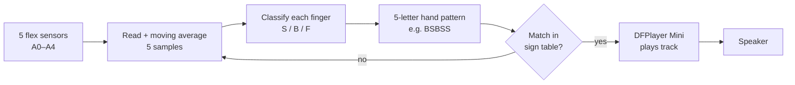

# Sign Language Glove

An Arduino glove that turns hand signs into speech. Five flex sensors measure how far each finger is bent, the firmware matches the hand shape against a table of American Sign Language (ASL) signs, and a DFPlayer Mini plays the matching word or phrase through a speaker.

## Why

Most people do not understand sign language, which makes everyday conversation hard for Deaf and hard-of-hearing people. A wearable that speaks signs aloud is a low-cost way to bridge that gap.

## How it works

1. **Calibration (on start-up):** over the Serial Monitor, the user holds all fingers straight, bent, then fully bent. The firmware averages 3 readings per position for each finger and warns if the values are not in increasing order.
2. **Smoothing:** each sensor is read every loop and averaged over the last 5 readings.
3. **Classification:** each finger is labelled **S** (straight), **B** (bent) or **F** (fully bent): first by checking whether the reading is within ±5 of a calibrated value, otherwise by which midpoint it falls on.
4. **Matching:** the five labels form a pattern such as `BSBSS`. If it matches a sign in the table, the DFPlayer plays that sign's audio track and the device waits 2 seconds.

## Hardware

| Component | Quantity | Notes |
| --- | --- | --- |
| Arduino board | 1 | Needs 5 analog inputs and `SoftwareSerial` support (for example an Uno or Nano) |
| Flex sensor | 5 | One per finger, each in a voltage divider |
| Resistor for each voltage divider | 5 | Value depends on the flex sensor |
| DFRobot DFPlayer Mini | 1 | MP3 player module |
| microSD card (FAT32) | 1 | Holds the audio tracks |
| Speaker | 1 | Connected to the DFPlayer speaker pins |
| Glove | 1 | Sensors mounted along each finger |

### Wiring

| Arduino pin | Connected to |
| --- | --- |
| A0–A4 | Flex sensor voltage dividers, thumb to little finger |
| D10 (SoftwareSerial RX) | DFPlayer TX |
| D11 (SoftwareSerial TX) | DFPlayer RX (a 1 kΩ series resistor is commonly recommended) |
| 5V / GND | DFPlayer VCC / GND, sensor dividers |

<!-- TODO: add a wiring diagram or photo of the circuit -->

## Supported signs

Pattern letters are per finger, in sensor order A0 to A4.

| Sign | Pattern | Track |
| --- | --- | --- |
| Hello | `BSBSS` | 2 |
| Goodbye | `SSSSS` | 1 |
| Thank you | `BSSBS` | 6 |
| Yes | `FFFFB` | 7 |
| No | `FFBFF` | 4 |
| Help | `FSFSS` | 3 |
| What's your name | `FSFFS` | 8 |
| I love you | `SSFFS` | 401 |
| A–Z | see `aslCommands[]` in the sketch | 9–34 |

The table also contains one custom phrase (track 5). Signs that rely on hand movement or orientation (such as J and Z) are approximated by finger shape only.

## Setup

1. Install the **DFRobotDFPlayerMini** library (Arduino IDE → Library Manager).
2. Copy the audio files to the microSD card. `myDFPlayer.play(n)` plays the *n*-th track, so name the files in order (`0001.mp3`, `0002.mp3`, …) and copy them in that order.
3. Open `SignLanguageGlove.ino`, select your board and port, and upload.
4. Open the Serial Monitor at **9600 baud**, press any key, and follow the three calibration steps.
5. Make a sign. The Serial Monitor shows the detected pattern and the track being played.

To add or change a sign, edit the `aslCommands[]` table: give it a name, a 5-letter pattern and a track number.

## Limitations

- Recognition uses finger bend only. There is no hand orientation or motion sensing, so signs that differ only in movement cannot be distinguished.
- Calibration has to be repeated after every reset, because values are not saved to EEPROM.
- Each sensor's three positions are calibrated with all fingers together, so individual finger ranges may vary.

## Future improvements

- Add an IMU to detect hand orientation and motion
- Save calibration to EEPROM
- Add a confidence threshold or a short hold time before speaking to avoid false triggers

## Demo

_To add:_ a photo of the glove and a short video of it speaking a few signs.

## Author

**Hsu Myat Noe** · [GitHub](https://github.com/NoeNoe25) · [LinkedIn](https://www.linkedin.com/in/hsu-myat-noe569aa729a/)
